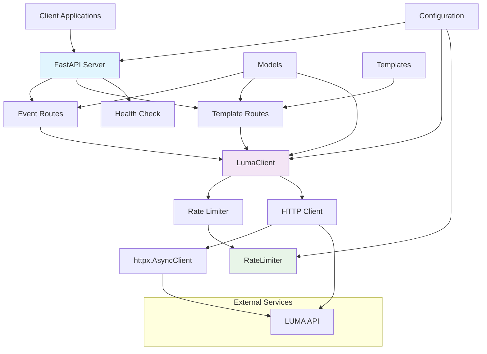

# LUMA MCP Server

A Model Context Protocol (MCP) server for creating and managing LUMA events. 

## Features

- **Event CRUD Operations**: Create, read, update, delete LUMA events
- **Event Templates**: Pre-built templates for common event types (meetups, workshops, conferences, etc.)

## Quick Start

### Prerequisites

- Python 3.8+
- LUMA Plus subscription with API access
- LUMA API key

### Installation


1. Set up environment variables:
```bash
cp .env.example .env
# Edit .env with your LUMA API key
```

2. Run the server:
```bash
python -m src.main
```

The server will start on `http://localhost:8000`.

## Configuration

Create a `.env` file with the following variables:

```env
# Required
LUMA_API_KEY=your_luma_api_key_here

# Optional (defaults provided)
LUMA_HOST=localhost
LUMA_PORT=8000
LUMA_DEBUG=false
```

## API Endpoints

### Events

- `POST /events/` - Create a new event
- `GET /events/{event_id}` - Get event details
- `PUT /events/{event_id}` - Update an event
- `DELETE /events/{event_id}` - Delete an event
- `GET /events/` - List events

### Templates

- `GET /templates/` - List available templates
- `GET /templates/{template_type}` - Get template details
- `POST /templates/create` - Create event from template

### Health Check

- `GET /health` - Service health check

## Event Templates

The server includes predefined templates for common event types:

- **Meetup**: Community gatherings (2 hours, no RSVP approval)


## Usage Examples

### Create an Event

```python
import requests

event_data = {
    "name": "Tech Meetup",
    "start_at": "2024-12-31T18:00:00Z",
    "timezone": "America/New_York",
    "end_at": "2024-12-31T20:00:00Z"
}

response = requests.post("http://localhost:8000/events/", json=event_data)
print(response.json())
```

### Create Event from Template

```python
template_data = {
    "template_type": "workshop",
    "name": "Python Workshop",
    "start_at": "2024-12-31T10:00:00Z",
    "timezone": "America/New_York",
    "meeting_url": "https://zoom.us/j/123456"
}

response = requests.post("http://localhost:8000/templates/create", json=template_data)
print(response.json())
```

## Development

### Prerequisites

- Python 3.8+
- [Poetry](https://python-poetry.org/) for dependency management
- LUMA Plus subscription with API access

### Setup Development Environment

1. Clone the repository:
```bash
git clone <repository-url>
cd luma_mcp
```

2. Install dependencies:
```bash
poetry install
```

3. Set up environment variables:
```bash
cp .env.example .env
# Edit .env with your LUMA API key
```

4. Install pre-commit hooks:
```bash
poetry run pre-commit install
```

### Running Tests

```bash
# Run all tests
poetry run pytest tests/

# Run with coverage
poetry run pytest --cov=src --cov-report=html tests/
```

### Code Formatting and Linting

```bash
# Format code
poetry run black src/ tests/

# Sort imports
poetry run isort src/ tests/

# Lint code
poetry run flake8 src/ tests/

# Type checking
poetry run mypy src/
```

### API Documentation

When running, visit `http://localhost:8000/docs` for interactive API documentation.

### Project Structure

```
src/
├── main.py              # FastAPI application entry point
├── config.py            # Configuration management
├── models.py            # Pydantic models and schemas
├── luma_client.py       # LUMA API client
├── routes/
│   ├── __init__.py
│   ├── events.py        # Event CRUD endpoints
│   └── templates.py     # Template management endpoints
└── utils/
    ├── __init__.py
    └── rate_limiter.py  # Rate limiting utilities
```

## Rate Limiting

The server implements rate limiting to respect LUMA API limits:

- GET requests: 500 per 5 minutes
- POST requests: 100 per 5 minutes
- Automatic retry with exponential backoff on rate limit errors

## Error Handling

The server provides detailed error responses:

```json
{
  "error": "Rate limit exceeded",
  "code": "429",
  "details": {...}
}
```

## Architecture

### System Overview

The LUMA MCP Server is built as a FastAPI-based REST API that provides a clean interface for managing LUMA events. It follows a layered architecture with clear separation of concerns:

- **API Layer**: FastAPI routes handling HTTP requests and responses
- **Business Logic Layer**: Event management and template processing
- **Data Access Layer**: LUMA API client with rate limiting and error handling
- **Infrastructure Layer**: Configuration, logging, and utilities

### Architecture Diagram



### Component Descriptions

#### Core Components

- **FastAPI Application** (`src/main.py`): Main application entry point with middleware, routing, and exception handling
- **LUMA Client** (`src/luma_client.py`): Async HTTP client for LUMA API interactions with retry logic and error handling
- **Rate Limiter** (`src/utils/rate_limiter.py`): Token bucket-style rate limiting to respect LUMA API limits
- **Configuration** (`src/config.py`): Environment-based configuration management using Pydantic settings

#### Route Modules

- **Events Router** (`src/routes/events.py`): CRUD operations for LUMA events
- **Templates Router** (`src/routes/templates.py`): Predefined event templates and creation from templates

#### Data Models

- **Pydantic Models** (`src/models.py`): Request/response schemas with validation and type safety

### Data Flow

1. **Request Processing**: FastAPI receives HTTP request and validates input using Pydantic models
2. **Rate Limiting**: Request is checked against rate limits before proceeding
3. **API Call**: LumaClient makes authenticated request to LUMA API with retry logic
4. **Response Handling**: API response is processed and formatted for client return
5. **Error Handling**: Comprehensive error handling with appropriate HTTP status codes

### Security Considerations

- API keys are stored in environment variables (never in code)
- HTTPS is enforced for all LUMA API requests
- Input validation using Pydantic models with length limits
- CORS disabled in production (server should be accessed directly)
- Error messages don't expose internal system details
- Rate limiting prevents abuse
- Request timeouts prevent hanging connections
